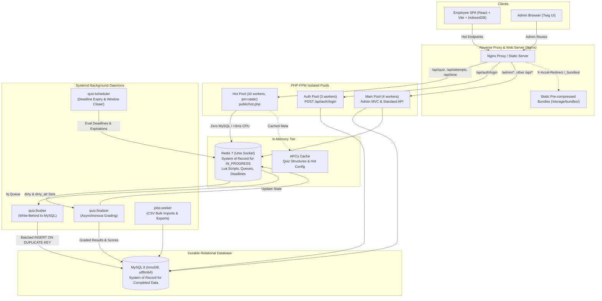

# Corporate Quiz Management System (CorpQuiz)

An enterprise-grade, high-concurrency employee assessment platform engineered to run reliably under **2,000+ concurrent active employees** on constrained hardware (a single 2 vCPU, 8 GB RAM VPS).

> 💡 **Framework Note:** This application is built on top of the in-house `dinzin-tech/simple-mvc` framework. For internal MVC conventions, controller annotations, query builder syntax, and basic boilerplate instructions, refer to [framework.md](file:///c:/Projects/DINZIN-Projects/corp-quizz-app/quizz-app/framework.md).

---

## 🏗️ System Design & Architecture Overview

### 1. The 2,000 Concurrent User Challenge

During corporate-wide assessments, traffic is characterized by three concentrated bursts ("load storms"):
1. **Entry & Start Storm:** 2,000 employees authenticate, fetch the quiz status, and trigger attempt start within a 20–120 second window (peaking at $\ge 100$ starts/sec).
2. **Answer Save Storm:** Continuous submissions across 20–60 questions per user, firing every 15–45 seconds (~70–130 req/s average, bursts to 300+ req/s), with mid-quiz reconnects and browser refreshes.
3. **Submit & Expiry Storm:** Over 60% of participants submit in the final 3 minutes (peaking at ~150 submits/sec), followed by simultaneous server-side auto-submission of all remaining attempts upon deadline expiry.

To survive these storms on a 2 vCPU machine without saturating CPU or deadlocking relational databases, CorpQuiz employs a **Bypass & Write-Behind Architecture**:



---

## ⚡ Core Architectural Pillars

### 1. Zero MySQL on the Hot Path
Traditional MVC applications instantiate ORM models and run SQL queries for every page view and answer save. Under 2,000 concurrent users, MySQL connections saturate and disk I/O bottlenecks.
- The employee quiz-taking path is handled exclusively by `public/hot.php`.
- Requests execute in under **3 ms CPU time**, verifying HMAC tokens, validating question structures in APCu memory, and invoking atomic Redis Lua scripts over a Unix socket (`/run/redis/redis-server.sock`).
- Zero database connections are opened during active quiz sessions (`Threads_connected` stays flat).

### 2. Redis as System of Record for `IN_PROGRESS` State
During active attempts, Redis holds the state:
- **`att:{aid}`**: Attempt metadata (status, started timestamp, deadline, layout, score, completion time).
- **`ans:{aid}`**: Hash of user answers (`question_id` $\rightarrow$ `"option_id|seq|timestamp"`).
- **`deadlines`**: Sorted set (`ZSET`) indexing active attempts by deadline millisecond.
- **`fq`**: List queue of completed attempts awaiting background grading.
- **`dirty` / `dirty_att`**: Unpersisted answer and attempt keys queued for write-behind.
- **`qstat:{quizId}`**: Live counter hash backing real-time admin KPIs without hitting MySQL.

### 3. Asynchronous Write-Behind & Background Processing
All database persistence and CPU-heavy operations happen outside the HTTP request lifecycle:
- **`quiz:flusher`**: Periodically drains `dirty` and `dirty_att` sets using `SPOP`, executing bulk `INSERT ... ON DUPLICATE KEY UPDATE` statements into MySQL in batches of up to 1,000 records.
- **`quiz:scheduler`**: Runs on a 1-second tick. It scans `deadlines` with `ZRANGEBYSCORE` to auto-submit expired attempts, pre-warms upcoming quizzes at $T-10$ minutes, and flips unstarted attempts to `ABSENT` once the quiz window closes.
- **`quiz:finalizer`**: Dequeues completed attempts from `fq`, evaluates them against the Redis answer key (`key:{quizId}:{ver}`), calculates accuracy/score, updates MySQL results, and sets `graded=1`.
- **`jobs:worker`**: Operates at lower CPU/IO priority (`nice -n 19`, `ionice -c3`) to handle bulk employee CSV imports and streaming Excel/CSV report exports without impacting quiz takers.

### 4. Client-Side Second Durable Copy & Monotonic Sync Protocol
Network disruptions and mobile reconnections are anticipated:
- The React SPA assigns each answer selection a monotonically increasing sequence number (`seq`) and commits it immediately to client-side **IndexedDB**.
- Batched saves are debounced (500 ms) and sent to `PUT /api/attempts/{aid}/answers`.
- The Redis Lua save script applies an update **only if `seq` is strictly greater than the stored sequence** for that question (last-write-wins).
- If the server response returns a `max_seq` lower than the client's highest acknowledged sequence (e.g. following a Redis failover or rehydration), the SPA client automatically replays all unpersisted changes. **Acknowledged answers are never lost.**

### 5. Static Pre-Compressed Bundles via `X-Accel-Redirect`
- When an admin publishes a quiz, `QuizPublisher` generates an immutable JSON snapshot of questions and options (strictly scrubbing all `is_correct` markers) and pre-compresses it with Gzip and Brotli into `storage/bundles/`.
- When an employee requests `GET /api/attempts/{aid}/bundle`, PHP verifies attempt ownership in $\sim 1$ ms and emits an `X-Accel-Redirect: /_bundles/...` header.
- Nginx delivers the static pre-compressed file directly via kernel-level `sendfile`, completely bypassing PHP output buffers and memory.

### 6. Process Pool Isolation (PHP-FPM)
A login storm involving password hashing (`bcrypt` costing 50–70 ms of CPU) can starve web workers. The infrastructure isolates workloads across three independent PHP-FPM pools:
- **`hot` pool (10 static workers):** Dedicated strictly to `/api/quiz/*`, `/api/attempts/*`, `/api/time`. Fast, non-blocking, zero database.
- **`auth` pool (3 static workers):** Dedicated to `POST /api/auth/login`. When saturated, excess logins queue or return `429/503` with `Retry-After`, leaving in-progress quizzes completely unaffected.
- **`main` pool (4 dynamic workers):** Dedicated to Twig admin views, CRUD operations, and reports.

---

## 📡 API Endpoints (Hot vs Standard)

### Employee Hot Fast-Path (`public/hot.php`)

| Method | Endpoint | Description |
|---|---|---|
| `GET` | `/api/time` | Returns high-precision server time in ms (`X-Server-Time` header) for timer calibration. |
| `GET` | `/api/quiz/{code}` | Fetches quiz status (`not_open`, `can_start`, `resumable`, `closed`), metadata, and attempt pointer. |
| `POST` | `/api/quiz/{code}/start` | Atomically initializes attempt in Redis, establishes deadline, randomizes question/option layout. |
| `GET` | `/api/attempts/{aid}` | Resumes attempt state, fetches user layout and currently saved answer map. Checks ULID ownership. |
| `GET` | `/api/attempts/{aid}/bundle` | Authorizes attempt and offloads delivery of questions bundle to Nginx `X-Accel-Redirect`. |
| `PUT` | `/api/attempts/{aid}/answers` | Atomically validates and persists answer selections using monotonic sequence numbers in Lua. |
| `POST` | `/api/attempts/{aid}/submit` | Atomically transitions attempt to `COMPLETED`, removes from `deadlines`, and pushes to `fq` queue. |

### Standard & Admin Endpoints (`public/index.php`)

| Method | Endpoint | Description |
|---|---|---|
| `POST` | `/api/auth/login` | Authenticates employee credentials against MySQL via bcrypt (isolated FPM pool). |
| `GET/POST`| `/admin/login` | Admin authentication portal with CSRF protection. |
| `GET` | `/admin/dashboard` | Displays the 9 real-time KPIs sourced from Redis `qstat` (no heavy SQL aggregates). |
| `GET` | `/admin/quizzes` | Quiz management, question ordering, option configuration, and snapshot publishing. |
| `GET` | `/admin/employees` | Employee directory and bulk CSV/XLSX import wizard with preview and validation. |
| `GET` | `/admin/reports` | Paginated submission tables and asynchronous CSV/XLSX export downloads. |

---

## 🗄️ Database & Storage Design

### Relational Schema (MySQL 8)
- **`employees`**: Internal identifiers, public ULID, `employee_code` (unique), credentials, and status.
- **`administrators`**: Admin user records and credentials.
- **`quizzes`**: Quiz definitions, schedule window (`start_at`, `end_at`), duration, settings JSON, and current version.
- **`questions` & `answer_options`**: Canonical quiz structure and correct answer markings.
- **`quiz_snapshots`**: Immutable published version bundles with SHA-256 checksums, answer keys, and structural definition JSONs.
- **`attempts`**: Per-employee attempt record (`NOT_STARTED`, `IN_PROGRESS`, `COMPLETED`, `ABSENT`), start/deadline timestamps, per-attempt shuffled layout JSON, score, accuracy, and completion duration.
- **`attempt_answers`**: Persisted user responses with sequence numbering and correctness flags (`is_correct` populated asynchronously by finalizer).
- **`import_jobs` & `export_jobs`**: Tracking tables for background file processing.

---

## 📁 Directory Structure

```text
corp-quizz-app/
└── quizz-app/
    ├── app/
    │   ├── Commands/              # Console daemons (flusher, scheduler, finalizer, warmer, seeder)
    │   ├── controllers/           # MVC Controllers for Admin portal and Auth
    │   ├── Hot/                   # Hot Fast-Path core (Token, Redis, Lua scripts, Clock, HotRouter)
    │   │   ├── lua/               # Atomic Lua scripts (start.lua, save.lua, submit.lua, absent.lua)
    │   │   ├── ApcuCache.php      # Fast APCu metadata cache
    │   │   ├── HotRouter.php      # High-performance regex dispatcher
    │   │   ├── LayoutGenerator.php# Fisher-Yates per-attempt randomization
    │   │   ├── Redis.php          # phpredis wrapper over Unix domain socket
    │   │   └── Token.php          # Compact HMAC-SHA256 token verification
    │   ├── Middlewares/           # Framework middlewares (AuthToken, RequireRole, RateLimiter)
    │   ├── models/                # Framework Active-Record models
    │   ├── Services/              # Domain logic (QuizPublisher, Submissions, ReportExport, etc.)
    │   └── views/                 # Twig templates for Admin Console
    ├── docs/
    │   ├── ACCEPTANCE.md          # Acceptance test matrix (DEV-01 to DEV-23)
    │   ├── ASSUMPTIONS.md         # Documented client assumptions and defaults
    │   ├── AUDIT.md               # Framework audit and benchmark notes
    │   ├── CICD.md                # GitHub Actions CI/CD pipeline setup guide
    │   └── RUNBOOK.md             # Operational runbook and disaster recovery procedures
    ├── ops/                       # Server configuration & deployment
    │   ├── mysql/                 # MySQL tuning (buffer pool, transactions)
    │   ├── nginx/                 # Nginx site configuration & X-Accel setup
    │   ├── php-fpm/               # Pool configurations (hot, auth, main)
    │   ├── systemd/               # Daemon unit files (quiz-flusher, scheduler, finalizer, jobs)
    │   ├── deploy.sh              # Zero-downtime deployment script
    │   └── provision.sh           # VPS baseline provisioning script
    ├── public/
    │   ├── app/                   # Built React SPA assets
    │   ├── hot.php                # High-concurrency bypass entry point
    │   └── index.php              # Standard MVC framework entry point
    ├── spa/                       # Employee SPA (React + TypeScript + Vite + Tailwind/CSS)
    ├── storage/                   # Logs, cache, and pre-compressed quiz bundles
    ├── tests/                     # Unit and Feature tests (PHPUnit)
    ├── docker-compose.yml         # Local development environment (Nginx, PHP-FPM, MySQL, Redis)
    ├── framework.md               # Underlying Simple-MVC framework documentation
    └── README.md                  # This system design documentation
```

---

## 🚀 Getting Started

### Prerequisites
- PHP 8.3 with `ext-redis`, `ext-pdo_mysql`, `ext-apcu`
- Composer 2.x
- MySQL 8.x
- Redis 7.x
- Node.js 18+ and npm (for SPA and asset building)

### Local Development Setup

1. **Clone the Repository & Install Dependencies:**
   ```bash
   cd quizz-app
   composer install
   cd spa && npm install && npm run build && cd ..
   ```

2. **Environment Configuration:**
   ```bash
   cp .env.example .env
   php bin/console keygenerate
   ```
   Configure database and Redis credentials in `.env`:
   ```ini
   DEFAULT_DB_HOST=127.0.0.1
   DEFAULT_DB_DATABASE=corp_quizz
   DEFAULT_DB_USER=root
   DEFAULT_DB_PASSWORD=secret
   REDIS_HOST=127.0.0.1
   REDIS_PORT=6379
   ```

3. **Run Database Migrations & Seeds:**
   ```bash
   php bin/console migrations:exec run
   php bin/console db:seed
   ```
   *The seeder provisions 1 administrator, 2,500 test employees, and 2 sample 40-question quizzes.*

4. **Cache Configuration:**
   ```bash
   php bin/console config:cache
   ```

5. **Start Background Daemons (in separate terminal sessions):**
   ```bash
   php bin/console quiz:flusher
   php bin/console quiz:scheduler
   php bin/console quiz:finalizer
   ```

6. **Serve Locally:**
   ```bash
   composer serve:dev
   ```
   Access the application at `http://localhost:8000`:
   - Admin Portal: `http://localhost:8000/admin/login`
   - Employee Portal: `http://localhost:8000/quiz/{code}`

---

## 🛡️ Operational Readiness & Runbook

For production assessment checklist, T-60 / T-15 pre-warming verification, queue monitoring commands, and disaster recovery procedures, please consult the complete [Operational Runbook](file:///c:/Projects/DINZIN-Projects/corp-quizz-app/quizz-app/docs/RUNBOOK.md).
